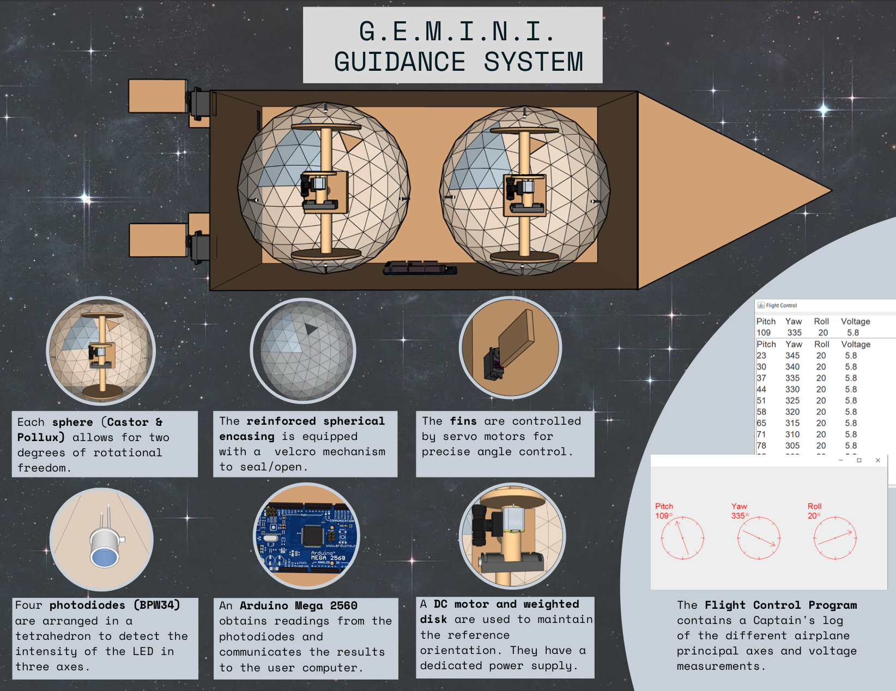

# GEMINI - 3-Axis Navigation System

GEMINI is a 3-axis spacecraft guidance system from the ground up. The unit is box-vessel containing gyroscopes consisting of papier-mâché encasings and tetrahedral photodiode systems via Arduino Bluetooth. GEMINI wirelessly displays a mission control using Java Swing, updating pitch, yaw, and roll in real-time.

## More Info

Read about the <a href="prospectus.pdf">prospectus</a>, various <a href="deviations.pdf">design deviations</a>, or the <a href="final-manual.pdf">operation manual</a>.   

